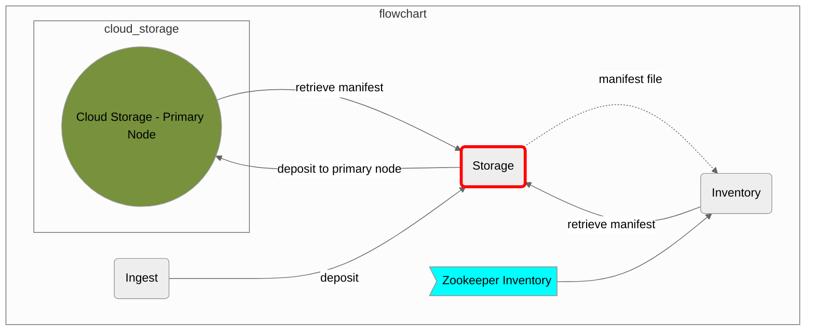
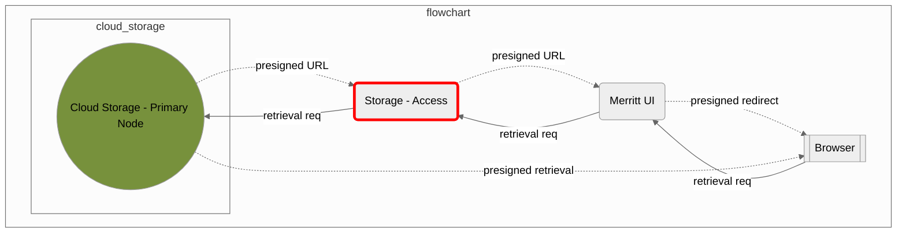
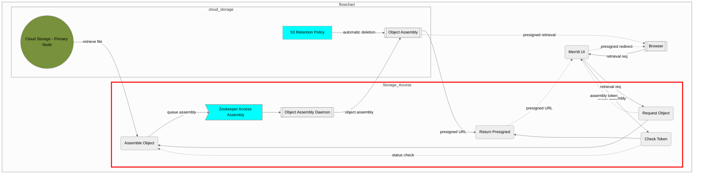

# Merritt Storage

This microservice is part of the [Merritt Preservation System](https://github.com/CDLUC3/mrt-doc).

## Purpose

This microservice provides an API for other Merritt microservices to interact with Merritt's cloud storage providers.

This microservice supports the ingest of new objects into the Merritt Preservation System 
and the retrieval of content from the Merritt Preservation System.

## Original System Specifications
- [Merritt Storage Service](https://github.com/CDLUC3/mrt-doc/blob/main/doc/Merritt-storage-service-latest.pdf)

## Component Diagram

### Merritt Store - Ingest Content

### Merritt Access - File Retrieval

### Merritt Access - Object Retrieval

## Dependencies

This code depends on the following Merritt Libraries.
- [Merritt Cloud API](https://github.com/CDLUC3/mrt-cloud)
- [Merritt Core Library](https://github.com/CDLUC3/mrt-core2)

## For external audiences
This code is not intended to be run apart from the Merritt Preservation System.

See [Merritt Docker](https://github.com/CDLUC3/merritt-docker) for a description of how to build a test instnce of Merritt.

## Build instructions
This code is deployed as a war file. The war file is built on a Jenkins server.

## Test instructions

## Internal Links
- https://github.com/CDLUC3/mrt-doc-private/blob/main/uc3-mrt-store.md
 
